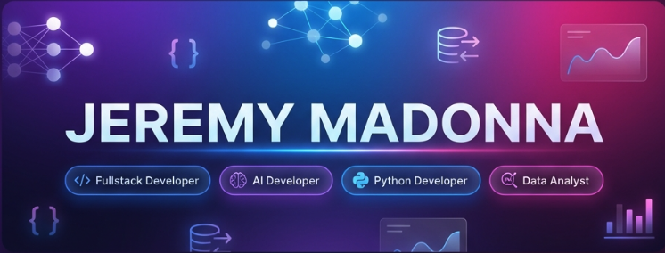

<div align="center">
  
</div>

<div align="center">
  
  [](https://git.io/typing-svg)
  
  
  
</div>

---

## 👨‍💻 About Me

```python
class JeremyMadonna:
    def __init__(self):
        self.name = "Jeremy Madonna Sebastian Joe"
        self.location = "Waterloo, ON 🇨🇦"
        self.education = {
            "current": "Business Analytics @ Conestoga College",
            "masters": "Computer Applications (Big Data & Analytics)",
            "bachelors": "Computer Applications (Database Management)"
        }
        self.roles = [
            "Fullstack Developer",
            "AI Developer", 
            "Python Developer",
            "Data Analyst"
        ]
        self.experience = "Former Assistant Professor | Data Science Educator"
        
    def get_current_focus(self):
        return [
            "🔭 Building intelligent data-driven applications",
            "🌱 Mastering AI/ML algorithms and deployment",
            "👯 Open to collaborate on innovative tech projects",
            "💡 Passionate about teaching and knowledge sharing"
        ]
    
    def say_hi(self):
        print("Thanks for visiting! Let's build something amazing together 🚀")

me = JeremyMadonna()
me.say_hi()
```

---

## 🛠️ Tech Stack

### Languages


### Frameworks & Libraries


### Data Science & AI


### Data Visualization


### Databases


### Tools & Platforms


---

## 📊 GitHub Statistics

<div align="center">
  
  
</div>

<div align="center">
  
</div>

<div align="center">
  
</div>

---

## 💼 Professional Experience

### 🎓 Assistant Professor | Holy Cross College
**Trichy, India** | *June 2022 – Aug 2023*

- 📚 Taught postgraduate courses: **Web Development, Python Scripting, Shell Scripting, API Design, Data Visualization**
- 🔬 Supervised graduate research projects in computer science
- 📖 Published research findings in academic journals
- 👥 Mentored students on career planning and professional development
- 🎯 Designed comprehensive curriculum with hands-on lab sessions

---

## 🎓 Education & Certifications

🎓 **Business Analytics** | Conestoga College, Ontario | *Jan 2025 – Aug 2025*

🎓 **Master's in Computer Applications** | Bharathidasan University | *Aug 2020 – Apr 2022*  
*Specialization: Big Data & Data Analytics*

🎓 **Bachelor's in Computer Applications** | Bharathidasan University | *June 2017 – July 2020*  
*Specialization: Database Management Systems*

🏆 **Google Career Certificate – Data Analyst** | *June 2024*

---

## 🚀 What I'm Up To

```javascript
const currentActivities = {
  learning: ["Advanced Machine Learning", "Cloud Architecture", "Full Stack Development"],
  building: ["AI-powered data analytics platform", "Interactive dashboards", "RESTful APIs"],
  reading: ["Deep Learning with Python", "System Design Interview"],
  goals_2025: [
    "Contribute to open-source AI projects",
    "Build 10+ full-stack applications",
    "Master cloud deployment (AWS/Azure)",
    "Complete Business Analytics program with distinction"
  ]
};
```

---

## 📫 Let's Connect!

<div align="center">
  
  [](https://linkedin.com/in/jeremymadonna)
  [](https://github.com/jeremymadonna)
  [](mailto:jeremymadonna2812@gmail.com)
  [](#)
  
</div>

---

## 💡 Fun Facts

- 🧠 I taught **Data Science** to postgraduate students before becoming a student again!
- 📊 I can turn messy data into beautiful insights faster than you can say "pivot table"
- 🤖 Building AI models is my idea of a fun weekend
- 🌍 From teaching in India to studying in Canada - always learning, always growing
- ☕ Powered by coffee and curiosity

---

<div align="center">
  
  ### 💭 Quote of the Day
  
  
  
  ---
  
  **⭐️ From [jeremymadonna](https://github.com/jeremymadonna)**
  
  *"Data is the new oil, but insights are the refined fuel that powers innovation"*
  
</div>
